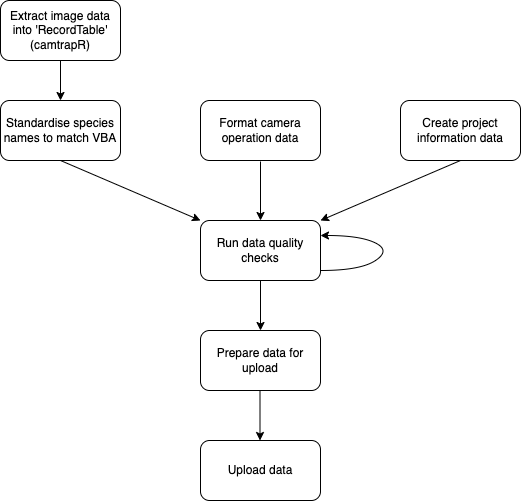

```{r, include = FALSE, results='hide'}
knitr::opts_chunk$set(
  collapse = TRUE,
  comment = "#>"
)
```

```{r setup, echo = FALSE, results='hide', message=FALSE, warning=FALSE}
library(weda)
library(dplyr)
library(camtrapR)
library(kableExtra)
library(ReDaMoR)
```

# Brief  

We need a process that takes (i) camera trap raw data and (ii) site information, and (iii) project information and uploads and processes them to the database in a consistent manner that allows data across projects to be stored together.    

# Input  

There are tree inputs in this process: 

1. A record table with camera trap records/data (generated from `camtrapR`) 
2. A camera information/site information table (generated from field data, e.g. `proofsafe`)  
3. A single row of details regarding the project (generated manually)   

See the [appendix](#appendix) for more information on column values in the data uploaded and processed on the database. 

# Camera trap database model  

Once this process is completed, data will be uploaded into the `raw` layer of the `camtrap` schema on the database. Automatic database views will process this raw data into the `curated` layer and `processed` layer. Zoom in to the figure below to see details about the data model:  

```{r datamodel, echo = FALSE, fig.cap="Camera trap database model with the colour signifying the layer of processing. All data is appended to the raw layer and then flows up automatically through database views. Data tables in raw and curated levels can be joined by common keys (e.g. ProjectShortName, SiteID, SubStation, ID). The colours and position represent the different layers (yellow = `raw`, blue = `curated`, and green = `processed`).", out.width = '100%'}
camtrap_data_model <- read_json_data_model(system.file("data-models/camtrap-model.json", package = "weda"))

plot(camtrap_data_model)
```


# Process  

The uploading of camera trap data will be undertaken in several steps:  




  
## Get record table  

You should have a directory with camera trap images that have been tagged. All images should be placed in a folder with the title of the station/site. An example of a directory structure for the dummy data is:  

```{r, echo = FALSE}
fs::dir_tree(system.file("dummydata/images", package = "weda"))
```

We have opted to allow for a two-tiered hierachical system for camera trap data, with a 'substation' folder (e.g. `A`) allowing to be nested in a 'site' folder (e.g. `56505`). `camTrapR` denotes this hierachy as `Station` and `Camera`. In our databasing we call the `Site` and `Substation`; with `SubStation` being nested within a site. This is useful in cases where you might have multiple cameras deployed close to one another at a site.  

To extract camera trap data we can use the `recordTable()` function from `camtrapR`. The parameters we use for the function are listed below and if tagging and folder structure is similar than we can keep it as follows.  

Note that depending on the number of metadata tags the number of columns for this data set may be different. In order for the camera trap records to meet the standard data format we may need to make some changes. The metadata tags are denoted with a `metadata_` prefix. See `recordTableSample` for more details. 

```{r camtrapextract}
raw_camtrap_records <- recordTable(inDir  = system.file("dummydata/images", package = "weda"),
                               IDfrom = "metadata", 
                               cameraID = "directory", 
                               stationCol = "SiteID",
                               camerasIndependent = TRUE,
                               timeZone = Sys.timezone(location = TRUE),
                               metadataSpeciesTag = "Species", 
                               removeDuplicateRecords = FALSE, 
                               returnFileNamesMissingTags = TRUE) %>%
  rename(SubStation = Camera) %>%
  mutate(SubStation = case_when(SiteID == SubStation ~ NA_character_, 
                                TRUE ~ SubStation), 
         Iteration = 1L)

raw_camtrap_records %>%
  kbl() %>% 
  kable_styling() %>%
  scroll_box(width = "100%")
```

## Standardise species names  

In our case, species names are Scientific names. In order to standardise the data we will run a function to append the common names to the data. The function uses VBA names and the full list of possibilities can be obtained in the exported dataset: `weda::vba_name_conversions` (e.g. run `View(weda::vba_name_conversions)`).   

Firstly, we can run the function just to check the names for conversion:  

```{r standardise_names}
standardise_species_names(raw_camtrap_records, 
                          format = "scientific", 
                          speciesCol = "Species",
                          return_data = FALSE)
```

As seen above, *Rusa unicolor* is not an accepted scientific name. In the VBA sambar deer are listed as *Cervus unicolor*. We can change this with code:  

```{r standardise_names2}
raw_camtrap_records_mod <- raw_camtrap_records %>% 
  mutate(Species = case_when(Species == "Rusa unicolor" ~ "Cervus unicolor", 
                             TRUE ~ Species))

raw_camtrap_records_standardised <- standardise_species_names(raw_camtrap_records_mod, 
                                                              format = "scientific", 
                                                              speciesCol = "Species")
```

All ticks and no warnings means we can move onto the next step.  

## Format operation data  

Alongside the camera trap records there must be a table that has details about the camera trap deployment at the site and the location of the site. This will be site information data users will have obtained from field sheets or proofsafe. The format of this data is based on the camera trap operation data used in `camtrapR` (see `data(camtraps)` for an example of this). For our example we read in an example of this data below with the necessary fields for each deployment. Alongside reading in we just format columns to correct classes. Note that the default CRS/epsg for coordinates is `4283`.      

```{r readdummyoperation}
operationdata <- readr::read_csv(system.file("dummydata/operationdata.csv", package = "weda"), 
                                 show_col_types = FALSE) %>%
  mutate(SiteID = as.character(SiteID), 
         Iteration = as.integer(Iteration), 
         CameraPhotosPerTrigger = as.integer(CameraPhotosPerTrigger))

operationdata %>%
  kbl() %>%
  kable_styling() %>%
  scroll_box(width = "100%")
```

## Create Project Data Row   

Alongside the camera data and the camera site/station information we also want to develop a row with project information that can link to all cameras and camera trap records for a project. Below we show the columns that would be in the project dataset. The data should only be one row and can easily made with the following code:  

```{r projectdata}
projectdata <- tibble(ProjectName = "Monitoring deer distribution, abundance, and impacts across Victoria",
                      ProjectShortName = "StatewideDeer",
                      DistanceSampling = TRUE, 
                      TerrestrialArboreal = "Terrestrial", 
                      AllSpeciesTagged = TRUE, 
                      BaitedUnbaited = "Unbaited", 
                      BaitType = "None")

projectdata %>%
  kbl() %>%
  kable_styling() %>%
  scroll_box(width = "100%")
```

## Data checks  

At this stage it is important to look at our three datasets and run data quality checks on them to ensure that they have sufficient data and are able to be properly linked. For this we have developed a single R function to fun the checks (`camera_trap_dq()`). This function uses `pointblank` R package to run extensive data checks. For data to be of sufficient quality it must pass all checks. The output of `camera_trap_dq()` provides three data quality statements (one for each table). You can use this to help identify errors in the data to fix before preparing the data for upload. 

```{r dataquality}
dq <- camera_trap_dq(camtrap_records = raw_camtrap_records_standardised, 
                    camtrap_operation = operationdata, 
                    project_information = projectdata)

dq[[1]]
dq[[2]]
dq[[3]]
```

As you can see from the above data quality checks there are two issues we should fix before re-running the data quality:  

1. In the camera trap records `metadata_Multiples` is not of class integer.  
2. In the camera trap records `metadata_Multiples` has some missing values.  

For the second point when there was only one individual in a photo it was not tagged with an integer. In these cases it should be 1. To fix these issues we could run:  

```{r dqfixed}
raw_camtrap_records_fixed <- raw_camtrap_records_standardised %>%
  mutate(metadata_Multiples = coalesce(as.integer(metadata_Multiples), 1L))

dq2 <- camera_trap_dq(camtrap_records = raw_camtrap_records_fixed, 
                    camtrap_operation = operationdata, 
                    project_information = projectdata)

# We can check it is passing all tests with: 
all(sapply(dq2, function(x) all(x[["validation_set"]][["all_passed"]])))
```

## Prepare data for upload  

Once all data quality issues are fixed, and only when all data quality issues are fixed you can prepare your data for upload to the database. This process (`prepare_camtrap_upload()`) will generate IDs for your records (to avoid duplicate records on the database) and properly format the data:  

```{r prepareupload}
data_for_upload <- prepare_camtrap_upload(dq2)
```

## Upload the data  

*Note that before uploading data you will need to have an established connection to the database (e.g. `con_odbc`) in your `R` environment. See the [vignette on database connection for more details](https://JustinCally.github.io/weda/articles/database-connect.html)*  

Using the data prepared for upload made above (`data_for_upload`) you can upload the the data in one line:

```{r upload, eval = FALSE}
con_odbc <- RPostgreSQL::dbConnect(odbc::odbc(), 
                                   Driver = "PostgreSQL Driver", 
                                   Server = "10.110.7.201", 
                                   Database = "ari-dev-weda-psql-01", 
                                   UID = "psql_user", 
                                   PWD = keyring::key_get(service = "ari-dev-weda-psql-01", 
                                                          username = "psql_user"), 
                                   Port = 5432, 
                                   sslmode = "require", 
                                   maxvarcharsize = 0)


upload_camtrap_data(con = con_odbc, 
                    data_list = data_for_upload, 
                    uploadername = "Justin Cally")
```

# Automatic Database Views  

Once uploaded, the `postgresql` database will append your data to several easy to interact with views:  

## Curated Layer  

The curated layer is basic processing with duplicates removed and most/all data fields retained:  

+ `curated_camtrap_operation`: Is a table that stores the most recent entries for all camera trap deployments across projects (i.e. no duplicate sites)  
+ `curated_camtrap_records`: Is a table that stores the most recent camera trap records across projects (i.e. no duplicate images). This is based on a unique image being determined based on the project, site, substation, date-time and filename.  
+ `curated_project_information`: Is a table that stores the most recent project information entries (i.e. no duplicate projects)  

## Processed Layer  

The processed layer is more heavily processed with duplicates removed and joins, summaries and more succinct tables:  

+ `processed_site_substation_presence_absence`: Is a table with the presence and absence of each species at each site. The possible absent species from each site are only derived from the species pool for a given project. This avoids absences of species for particular projects that did not set out to record that species.  

+ `processed_site_substation_daily_presence_absence`: As above but now all presences and absences are daily. Includes early truncation of camera deployment from the `curated_camtrap_operation` dataset when there is a problem with the operation period.  

```{r, eval = FALSE}
# This is how you write the views. It only needs to be done once: 
DBI::dbExecute(conn = con_odbc, paste(DBI::SQL("CREATE VIEW camtrap.curated_camtrap_records AS"), records_curated_view(con_odbc)))
DBI::dbExecute(conn = con_odbc, paste(DBI::SQL("CREATE VIEW camtrap.curated_camtrap_operation AS"), operation_curated_view(con_odbc)))
DBI::dbExecute(conn = con_odbc, paste(DBI::SQL("CREATE VIEW camtrap.curated_project_information AS"), project_curated_view(con_odbc)))

DBI::dbExecute(conn = con_odbc, paste(DBI::SQL("CREATE VIEW camtrap.processed_site_substation_presence_absence AS"), processed_SubStation_presence_absence(con = con_odbc, return_data = FALSE)))

DBI::dbExecute(conn = con_odbc, paste(DBI::SQL("CREATE VIEW camtrap.processed_site_substation_daily_presence_absence AS"), processed_SubStation_presence_absence(con = con_odbc, daily = TRUE, return_data = FALSE)))
```

# Appendix  

A data dictionary is provided in this package (`data(data_dictionary)`) and also available in the `data_dictionary` schema. Below is the data dictionary for the `camtrap` schema:  

```{r datadict}
data_dictionary %>% 
  filter(schema == "camtrap") %>% 
  select(table_name, table_description, column_name, column_class, column_description) %>%
  kbl() %>%
  kable_styling(c("condensed"), full_width = F) %>%
  collapse_rows(1:3, valign = "top") %>%
  scroll_box(width = "100%", height = "1000px")
```

